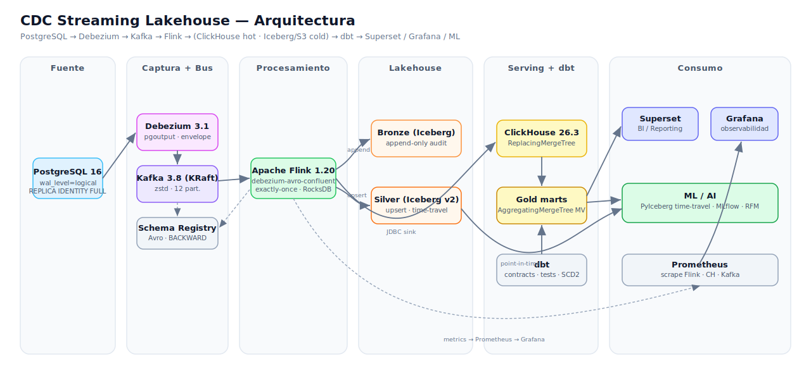

# CDC Streaming Lakehouse

Pipeline de **Change Data Capture (CDC) + Streaming** de extremo a extremo, listo para
producción, con arquitectura *lakehouse* y separación *hot/cold*. Captura cambios de una
base OLTP en tiempo real, los procesa como *changelog* con semántica exactly-once y los
materializa simultáneamente para **BI/Reporting** (baja latencia) y **ML/AI**
(histórico reproducible con *time-travel*).

```
PostgreSQL → Debezium → Kafka (Avro/Schema Registry) → Flink
        ├── Bronze  (Iceberg, append-only, auditoría)
        ├── Silver  (Iceberg v2, upsert, estado actual, time-travel)
        └── ClickHouse (ReplacingMergeTree, serving OLAP)
                          → dbt (Gold marts) → Superset · Grafana · ML/AI
```



---

## Tabla de contenidos
1. [Stack](#stack)
2. [Por qué este diseño](#por-qué-este-diseño)
3. [Quickstart](#quickstart)
4. [Capa por capa](#capa-por-capa)
5. [Optimizaciones](#optimizaciones)
6. [Integración ML/AI y BI/Reporting](#integración-mlai-y-bireporting)
7. [CI/CD](#cicd)
8. [Infraestructura (Terraform)](#infraestructura-terraform)
9. [Estructura del proyecto](#estructura-del-proyecto)
10. [Documentación](#documentación)

---

## Stack

| Capa | Tecnología | Versión |
|---|---|---|
| Fuente OLTP | PostgreSQL | 16.4 |
| Captura CDC | Debezium | 3.1 |
| Bus de eventos | Apache Kafka (KRaft) + Schema Registry | 3.8 / CP 7.8 |
| Procesamiento | Apache Flink (LTS) | 1.20.5 |
| Almacenamiento histórico | Apache Iceberg + S3/MinIO | 1.11 |
| Serving OLAP | ClickHouse | 26.3 LTS |
| Transformación / calidad | dbt + dbt-clickhouse | 1.8.x |
| BI | Apache Superset | 4.1.1 |
| Observabilidad | Grafana + Prometheus | 11.6 / v3.3 |
| IaC | Terraform | ≥ 1.9 |

> Todas las versiones están parametrizadas en `.env.example`.

## Por qué este diseño

- **Envelope completo de Debezium (sin `unwrap`).** Flink consume el changelog nativo
  vía `debezium-avro-confluent` y aplica **upserts y deletes reales** aguas abajo.
- **Fan-out con tres semánticas** desde un único job Flink (`STATEMENT SET`): Bronze
  (auditoría append-only), Silver (estado actual *merge-on-read*) y ClickHouse (serving).
- **Hot/Cold split.** ClickHouse para dashboards y *online features* (ms); Iceberg+S3
  para histórico ilimitado, *time-travel* y *batch ML* económico.
- **Exactly-once de punta a punta.** Idempotencia Kafka + checkpoints Flink + upsert
  idempotente ⇒ reprocesos y *redeploys* (savepoint-aware) sin duplicar ni perder datos.

## Quickstart

Requisitos: Docker + Docker Compose v2, `make`, ~8 GB RAM libres.

```bash
make init                # copia .env y prepara directorios
make up                  # levanta el stack completo (perfil all)
make bootstrap           # crea topics/buckets y espera readiness
make register-connectors # registra el conector Debezium
make deploy-flink        # despliega el job CDC (SQL en orden)
make ddl-clickhouse      # crea tablas serving + rollups
make dbt-run             # construye marts Gold
make smoke               # healthcheck E2E
```

Perfiles selectivos (más livianos):

```bash
make up-core     # postgres + kafka + schema-registry + connect
make up-process  # + flink + minio + iceberg-rest
make up-serving  # + clickhouse
make up-bi       # + superset + grafana + prometheus
```

UIs locales: Flink `:8081` · ClickHouse `:8123` · Superset `:8088` · Grafana `:3000` ·
MinIO `:9001` · Kafka Connect `:8083` · Schema Registry `:8081(SR)`.

Carga sintética para ver datos fluir:

```bash
python scripts/generate_load.py --rate 20 --duration 120
```

## Capa por capa

- **PostgreSQL** (`infra/postgres/init/`): esquema e-commerce (`customers`, `products`,
  `orders`, `order_items`), `wal_level=logical`, `REPLICA IDENTITY FULL`, publicación
  `dbz_publication` y tabla `debezium_signal` para *incremental snapshots*.
- **Debezium** (`infra/connect/connectors/postgres-source.json`): `pgoutput`, envelope
  completo, heartbeat, DLQ `_dlq.pg-oltp-source`, decimales precisos, Avro+SR.
- **Flink** (`flink-jobs/`): catálogo Iceberg REST, fuentes CDC, *fan-out* atómico vía
  `STATEMENT SET`, mantenimiento Iceberg (`99_maintenance.sql`). Despliegue por PyFlink
  (`flink-jobs/python/jobs/cdc_pipeline.py`).
- **Iceberg** (Bronze/Silver): v2 *merge-on-read*, *hidden partitioning*, Parquet+ZSTD.
- **ClickHouse** (`infra/clickhouse/`): `serving.*_rt` ReplacingMergeTree + MVs
  AggregatingMergeTree de rollup.
- **dbt** (`dbt/`): `staging → intermediate → marts/{core,ml}` con *contracts*, tests,
  snapshots SCD2 y *exposures*.
- **Consumo**: Superset (BI), Grafana (observabilidad), ML/AI (PyIceberg + MLflow).

## Optimizaciones

**Kafka:** KRaft (sin ZooKeeper), compresión `zstd`, 12 particiones, productores
idempotentes, `auto-create` deshabilitado, retención controlada.
**Debezium:** `pgoutput`, *incremental snapshots* vía tabla señal (sin parar el stream),
heartbeat para avanzar el slot, `REPLICA IDENTITY FULL`, DLQ.
**Flink:** exactly-once, checkpoints RocksDB **incrementales** + *unaligned*, *mini-batch*
+ agregación en dos fases, *state TTL* (36h), reinicio exponencial, escritura Iceberg con
*upsert* + *hash distribution* + objetivo de 128 MB por archivo, *deploy* savepoint-aware.
**ClickHouse:** ReplacingMergeTree + `FINAL`, partición mensual, codecs
`Delta`/`T64`/`ZSTD`, `LowCardinality`, *async inserts* (default en 26.3), MVs
AggregatingMergeTree, *skip-index* de tipo `set`.
**Iceberg:** *hidden partitioning*, Parquet+ZSTD, *compaction* + `expire_snapshots` +
`remove_orphan_files` programados, v2 *merge-on-read*.
**dbt:** incremental `delete+insert`, *contracts enforced*, tests con `dbt_expectations`,
snapshots SCD2, *exposures*, *source freshness*.

## Integración ML/AI y BI/Reporting

- **ML/AI:** Silver en Iceberg ofrece *time-travel* para *training sets*
  reconstruibles (sin *label leakage*). `ml/feature_pipeline/build_training_set.py`
  lee snapshots con PyIceberg; `ml/training/train_segmentation.py` entrena KMeans sobre
  RFM con *sweep* de `k` y registro en MLflow. *Online features* se sirven desde
  ClickHouse (`ml/serving/online_features.sql`), evitando *training/serving skew*.
- **BI/Reporting:** marts Gold gobernadas con *contracts* y tests; Superset conecta vía
  `clickhouse-connect`; Grafana combina Prometheus (operativo) + ClickHouse (negocio).

Detalle completo en [`docs/ml-integration.md`](docs/ml-integration.md).

## CI/CD

GitHub Actions (`.github/workflows/`):
- **`ci.yml`** — lint Python (ruff/black), SQL (sqlfluff), validación de
  `docker-compose` y JSON de conectores/dashboards.
- **`dbt-ci.yml`** — *Slim CI*: levanta ClickHouse efímero, `dbt build` de
  `state:modified+` con `--defer`, genera docs y persiste el manifest.
- **`cd-flink.yml`** — build/push de imagen Flink a GHCR y *deploy* savepoint-aware
  (savepoint → resubmit desde estado).
- **`terraform.yml`** — `fmt`/`validate`/`plan` por entorno y `apply` en `main` (prod).

Jenkins equivalente en [`jenkins/Jenkinsfile`](jenkins/Jenkinsfile).

## Infraestructura (Terraform)

`terraform/` provisiona el equivalente gestionado en AWS:
- **`modules/storage`** — buckets S3 (lakehouse/warehouse/savepoints) con versioning,
  SSE-KMS, *public access block* y *lifecycle* (Glacier IR para datos fríos).
- **`modules/streaming`** — MSK (Kafka gestionado, `zstd`, RF/ISR), Glue Schema Registry
  e IAM role para Flink (acceso S3 + MSK + Glue).
- **`envs/{dev,prod}`** — cableado de módulos con KMS por entorno y *backend* S3 opcional.

```bash
cd terraform/envs/dev
terraform init
cp terraform.tfvars.example terraform.tfvars   # ajusta vpc/subnets
terraform plan
```

## Estructura del proyecto

```
cdc-streaming-lakehouse/
├── docker-compose.yml          # stack completo (perfiles: core/process/serving/bi/all)
├── Makefile                    # orquestación de tareas
├── .env.example                # versiones, credenciales y puertos
├── infra/                      # configuración de cada servicio
│   ├── postgres/init/          # esquema OLTP + publicación + señal CDC
│   ├── connect/connectors/     # conector Debezium (envelope, DLQ, Avro)
│   ├── schema-registry/schemas # contratos Avro + política de compatibilidad
│   ├── flink/                  # Dockerfile + flink-conf.yaml
│   ├── clickhouse/             # config, users, DDL serving + rollups
│   ├── superset/               # imagen + bootstrap BI
│   ├── grafana/ · prometheus/  # observabilidad
│   └── minio/ · iceberg/
├── flink-jobs/
│   ├── sql/                    # 00..05 pipeline + 99 mantenimiento
│   └── python/                 # deployer PyFlink
├── dbt/                        # staging→intermediate→marts/{core,ml}, snapshots, tests
├── ml/                         # feature_pipeline, training (MLflow), serving
├── terraform/                  # modules/{storage,streaming} + envs/{dev,prod}
├── scripts/                    # bootstrap, register-connectors, deploy, healthcheck, load
├── tests/integration/          # E2E pytest (PG → ClickHouse)
├── docs/                       # arquitectura, data-flow, runbook, ml-integration
├── .github/workflows/          # CI, dbt Slim CI, CD Flink, Terraform
└── jenkins/Jenkinsfile         # pipeline equivalente en Jenkins
```

## Documentación

- [`docs/architecture.md`](docs/architecture.md) — decisiones y componentes.
- [`docs/data-flow.md`](docs/data-flow.md) — flujo tramo a tramo y garantías.
- [`docs/operations-runbook.md`](docs/operations-runbook.md) — arranque, incidentes,
  mantenimiento y *deploy* savepoint-aware.
- [`docs/ml-integration.md`](docs/ml-integration.md) — ML/AI + BI/Reporting.

## Licencia

Apache 2.0 — ver [`LICENSE`](LICENSE).
